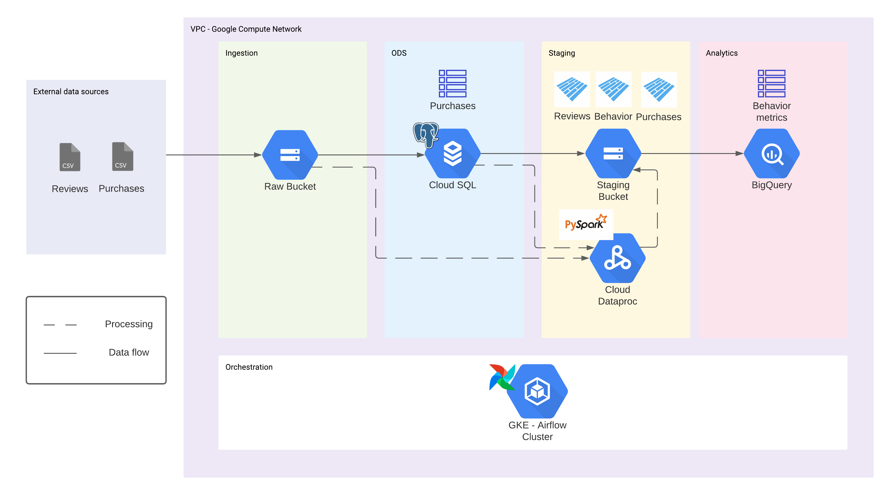

# ETL pipeline for Data Analytics

Welcome to this repository, where you will take a look at a cloud data pipeline for analytics implemented on GCP using Terraform, Airflow and PySpark.

## Instalation

[Prerequisites](Prerequisites.md)

[Terraform directory](01-terraform/README.md)

[Airflow directory](02-airflow/README.md)

## Data pipeline concepts and architecture

A data pipeline is a series of steps or stages to process data. This concrete implementation consists of four of them:

- Ingestion: fetching raw data from its source to strategic places in the pipeline
    - Data lake: storage bucket as a data lake to hold raw information
    - Operational Data Store: consists of an SQL instance to hold semi structured data ready for transformation
- Processing: consists of transformation of ingested data using a distributed data processing framework to add value to the provided information.
- Staging: consists of storing clean data in a strategic place inside the pipeline for analytics querying
- Analytics: involves using a data warehourse tool to query staged data and do reporting

This is the architecture diagram for this repo's data pipeline

A small explanation:

- Raw data comes in CSV format
- Apache Airflow is running in a GKE cluster to orchestrate all of the data flow in the pipeline
- GCS buckets are used to hold information in different stages
- PostgreSQL runs in a Cloud SQL instance to acts as the ODS
- Apache Spark is used as the distributed data processing framework
- BigQuery will consume data from Apache Parquet files in staging area by using External Tables